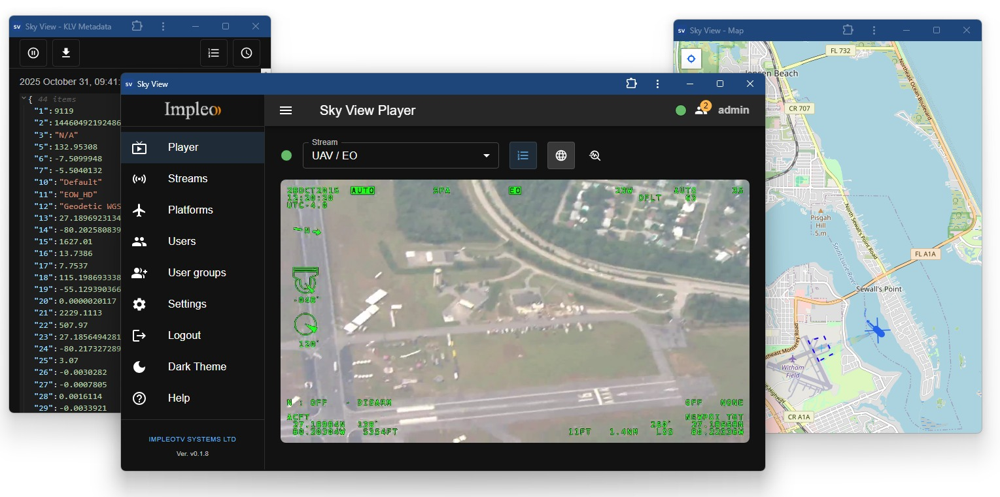
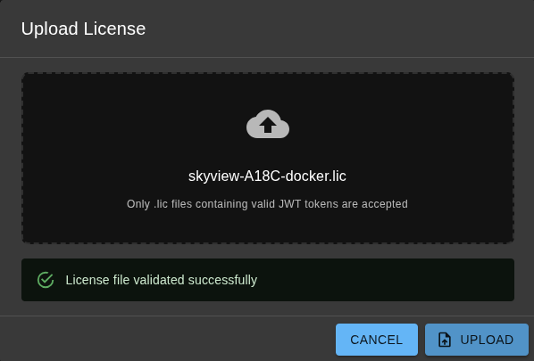

<div align="center">
  <a >
    
  </a>
</div>

# SkyView

**SkyView** is an application designed for live playback and analysis of **STANAG 4609** video streams.  
Built as a Progressive Web Application (**PWA**), SkyView can run seamlessly on your **local host**, **local network**, or in the
**cloud**.  
Users can install the **SkyView** front-end player directly on their desktop, tablet or mobile devices, enjoying a native-like experience.



More [info](https://impleotv.com/content/skyview/help/).

## System Requirements

OS: Linux x64.

## Installation (using Docker Compose)
**SkyView** is a STANAG 4609 player that ships as a single Docker container with an embedded web UI. Once deployed, you can access the interface from any browser and optionally install it as a Progressive Web App (PWA) for offline use and a native-like experience.

## Prerequisites

 - **Docker** 24+ installed on your system
  - Linux: Native Docker Engine
  - Windows: Docker Desktop (with limitations on multicast support) or VM
- **Docker Compose** (recommended for easier management)

## Quick Start

The fastest way to get SkyView running:

**Create a `docker-compose.yml` file:**  
```yaml  
  services:
    sky-view:
      image: impleo/sky-view:latest
      container_name: skyview
      network_mode: host
      environment:
        SKY_VIEW_SERVER_ADDR: ":8100"
        SKY_VIEW_DB_PATH: "/data/sky-view.db"
      volumes:
        - data:/data
      restart: unless-stopped

volumes:
  data:
```

> ℹ️ For multicast UDP stream support, SkyView requires `network_mode: host`, which is only available on Linux. Docker Desktop (Mac/Windows) has limited multicast capabilities.


**Start the container:**
```bash
  docker compose up -d
```

**Access the UI:**

Open your browser and navigate to `http://localhost:8100`

That's it! For more deployment options and configuration details, see [Running SkyView with Docker](./running-docker.md).

---

## Direct download link

|          | Version             | Download link                                                           | 
|:---------|:-------------------:|:------------------------------------------------------------------------|
| **SkyView (Linux x64)** |  v0.6.4 | [sky-view-install.tar.gz](https://github.com/impleotv/sky-view-release/releases/download/v0.6.4/sky-view-install.tar.gz)  | 


*Released on 2025-11-11*

> ⚠️ The docker-compose.yml file included with the installation contains a preconfigured reverse proxy (Caddy). If you don't need it or prefer to use a different service, simply remove the caddy service from the Docker Compose file.

---

## License

Without a license, the SkyView application will operate in demo mode with certain restrictions.
To remove these limitations, obtain a license and upload it through the application's user interface.


### License options

SkyView optional features are enabled by a license:

| Feature | Description |
|---------|-------------|
| **User & Group Management** | **JWT-based authentication and authorization** for secure and controlled access |
| **SRT playback** | Secure Reliable Transport (**SRT**) protocol support |
| **Error detection** | MPEG-TS and KLV integrity issues |

### License restrictions

| Restriction | Description |
|---------|-------------|
| **MaxClients** | Maximum number of simultaneously connected clients |
| **MaxStreams** | Maximum number of simultaneous streams|


### Obtaining a license

To obtain a license, please follow these steps:

- Install the server software on your target machine.
- Complete the [online form](https://docs.google.com/forms/d/e/1FAIpQLSd_XW6bDsFce1G1cpds4gMQNlwNax0CvkWzcMbscxZ5rLaIbA/viewform) and provide the **Node Info** string for the target machine (IMPORTANT).

The Node Info string can be found in the License dialog. The GUI shows the Node Info in two equivalent forms: the full Node Info text and a QR code that encodes the same text. You can either copy and paste the Node Info string directly into your support message, or, if that's more convenient (for example during an offline installation), take a clear photo of the QR code and send the image to us. When using a photo, make sure the QR code is fully visible and in focus so it can be scanned reliably.

*Please note that licenses will be issued after the product has been purchased.*


## Uploading a license

To upload your license, use the application’s user interface — either drag and drop the license file into the designated area, or click “Select file” to browse and choose the license file manually.



After a successful license upload, you should see descriptive information about the license (for example, available options, license restrictions, expiration date, or scope). The detailed license content can be reviewed by clicking the "Show license" button in the dialog. Removing the license will bring the application back into demo mode and re-enable the associated limitations.

---

## Known issues

In Firefox, pop-up windows (KLV and Map) may sometimes open blank. To resolve this, try touching or resizing your main application window.


*Please don't hesitate to contact us at support@impleotv.com should you have any questions.*